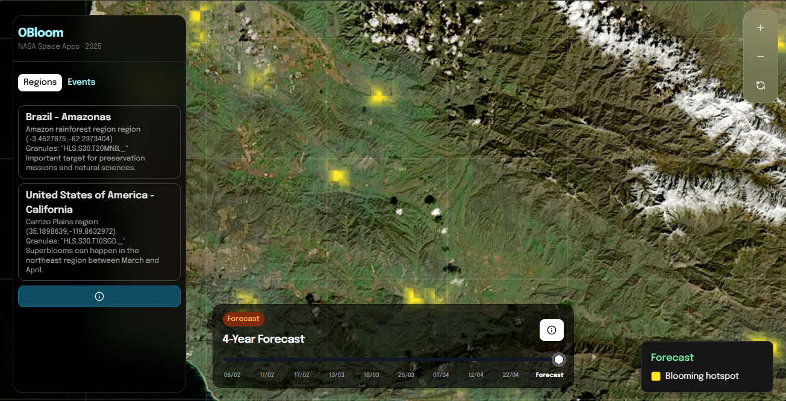
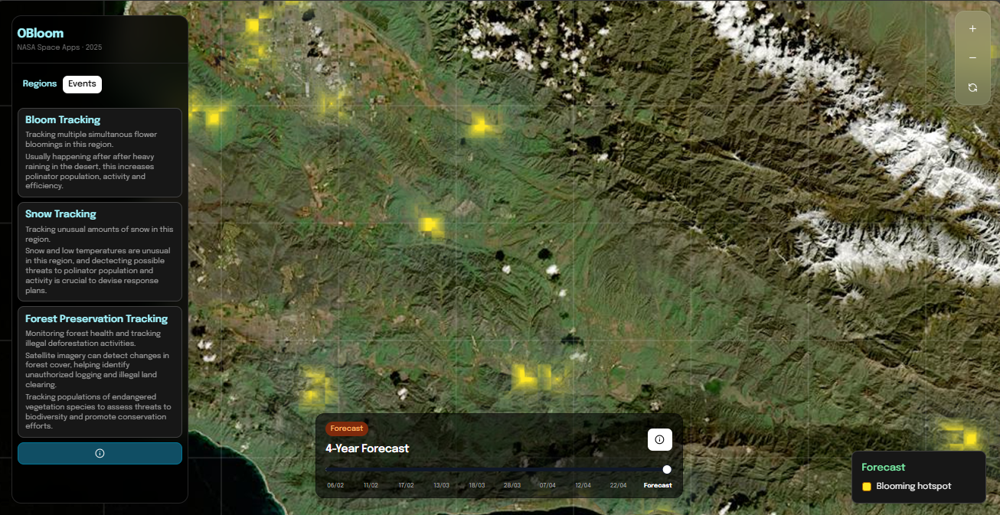

# OBloom

OBloom is a project for monitoring and visualizing environmental data, focusing on the detection of blooms.

The bloom prediction workflow consists of the following steps:
1. Multispectral Index Calculation 
   Various spectral indices are computed using satellite bands (Bands 02–06, B10, and B11), including:  
  - NDYI (Normalized Difference Yellowness Index)
  - SWIR1 (Short-Wave Infrared)
  - ND_NIR_SWIR (Normalized Difference Near-Infrared and Shortwave Infrared)
  - NDVI (Normalized Difference Vegetation Index)
  - FII (Flower Intensity Index)
2. Feature Extraction
   From the calculated indices, multiple features are derived, such as:
  - Neighborhood values
  - Delta (change) values
  - Contextual data, including the season and day of the year
3. Model Training and Prediction
   A Random Forest Regressor model is trained using these features. The model predicts:
  - The timing of the next bloom occurrence
  - A flower intensity map for the predicted event
4. Forecasting and Visualization
   This methodology enables accurate forecasting and effective visualization of bloom dynamics over time.

## Test URL

Access the proof of concept (POC) at the link below:

[Go to the test environment](https://labs.obixy.com.br/)

## How to use

1. Clone the repository:
    ```bash
    git clone https://github.com/Obixy/bloomwatch.git
    ```
2. Install the dependencies:
    ```bash
    cd bloomwatch/frontend
    npm install
    ```
3. Start the application:
    ```bash
    npm run dev
    ```

## Running the Polyglot Notebook in VS Code

To run the Polyglot notebook included in this project, follow these steps:

1. Install the [Polyglot Notebooks extension](https://marketplace.visualstudio.com/items?itemName=ms-dotnettools.dotnet-interactive-vscode) in Visual Studio Code.
2. Open VS Code and navigate to the notebook file:
    ```
    ./scripts/Satellite Feature Extraction & Forecasting Pipeline.ipynb
    ```
3. Click the file to open it. VS Code will automatically recognize the notebook and display execution options.
4. Select the appropriate kernel for each cell if needed.
5. Run the notebook cells by clicking the "play" button next to each cell or by using the `Run All` command.

This allows you to explore and execute the feature extraction and forecasting pipeline directly within VS Code.

## Technologies used

- JupterNotebooks
- React

## Screenshots

Here is the screen that allows you to view the monitored regions and analyze, through the timeline, the bloom events that occurred during the selected period.



Below is an image illustrating how users can select specific events to analyze within the chosen region. This feature enables focused investigation of particular occurrences and helps users correlate different events for deeper insights.

